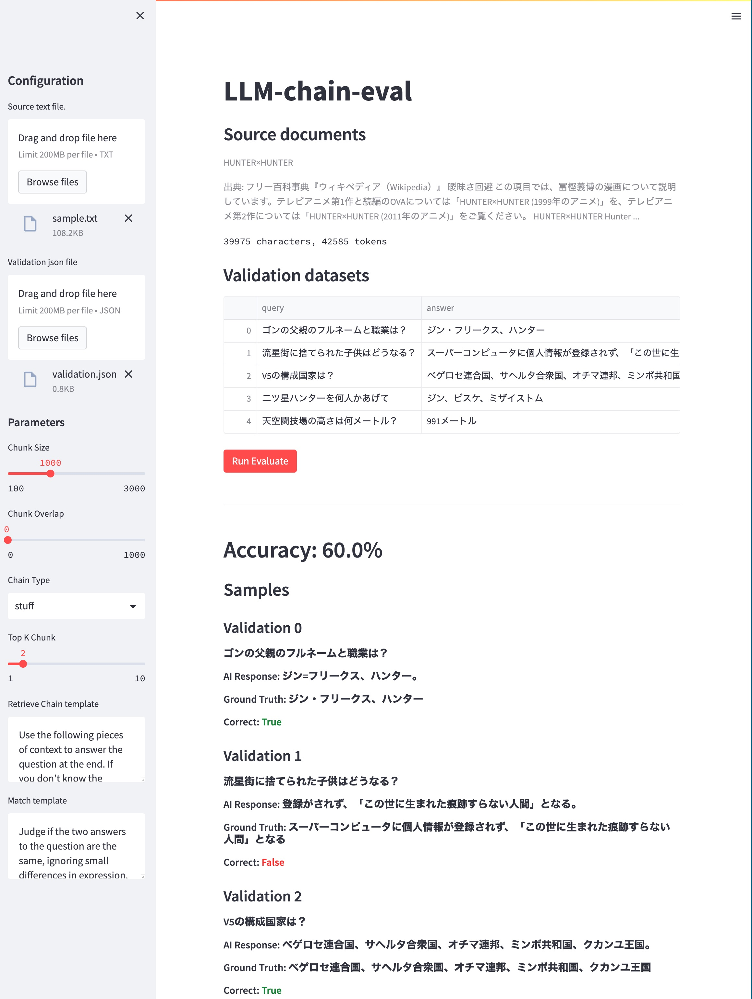

## LLM Chain Eval: Unleash the Power of Language Models
LLM Chain Eval is a highly flexible and potent tool crafted to fine-tune parameters and evaluate state-of-the-art Language Models (LMs) such as GPT-3.5-turbo and GPT-4. This repository enables you to experiment with diverse parameters, examine input-output behavior, and evaluate the overall performance of your models to achieve the optimal output.

## Core Features
- Currently specializes in Question-Answering (QA) input-output scenarios.
- Aspires to evolve into a comprehensive tool for appraising LMs across various tasks and applications.
- Encourages community-driven contributions to augment its capabilities.

### Supported LMs
- OpenAI gpt-3.5-turbo
- OpenAI gpt-4
- google/flan-t5-large (HuggingFaceHub)
- google/flan-t5-xl (HuggingFaceHub)
- databricks/dolly-v2-3b (TBD)

### Embeddings
- OpenAIEmbeddings
- HuggingFaceEmbeddings
- Flan-t5 (TBD)

### Tunable Parameters
- Chunk Size
- Chunk Overlap
- Chain type

### Customizable Prompt Templates
- Modify prompts for QA scenarios.
- Match templates to verify answer accuracy.

## Quick and Easy Setup
1. Clone the repository:

```
git clone https://github.com/tan-z-tan/llm-chain-eval.git
cd llm-chain-eval
```

2. Install required packages:
```
pip install -r requirements.txt
```

3. Set your OPENAI_API_KEY `XXX`:
```
echo OPENAI_API_KEY=XXX > .env
```

Put your HUGGINGFACEHUB_API_TOKE `YYY` if you want to use HuggingFaceHub.
```
echo HUGGINGFACEHUB_API_TOKEN=YYY >> .env
```

## Run the App
```shell
streamlit run app.py 
```

- Upload source file (see sample_text.txt)
- Upload validation file (see sample_validation.txt)



## Contributing
We welcome contributions from the community to help make LLM Chain Eval a more powerful and versatile tool. If you have any ideas, suggestions, or improvements, please feel free to submit a pull request or open an issue. We appreciate your support in making this tool better for everyone!

## License
This project is licensed under the MIT License.
